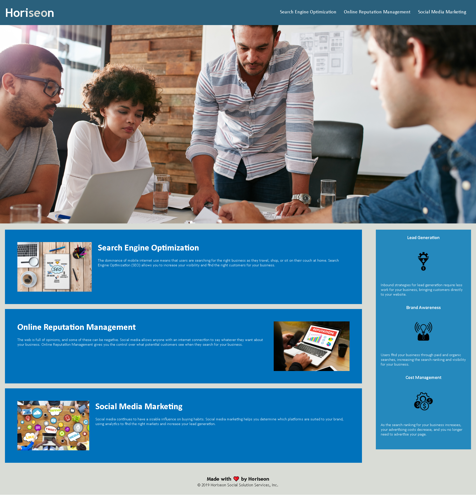

# weekonehomework

For the purpose of long-term sustainability, I have cleaned up the CSS and consolidated some of the selectors and properties. I have also made use of the semantic elements (footer, nav, header, section etc.) instead of having unnecessary div classes. I have provided comments throughout the stylesheet and the index.html so you can see where each section is clearly, allowing you to efficiently look through and identify different elements and the structure of the code. I have also verified that all links work and provided a title for the page. I have added accessible alt attributes where needed, and placed the heading attributes in sequential order as well.

Link to deployed application: https://cnb10100.github.io/weekonehomework/

Screenshot of deployed application: 